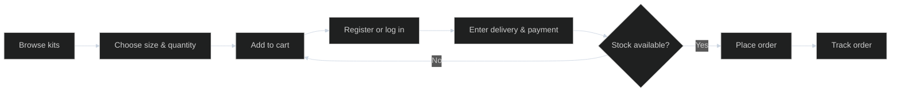
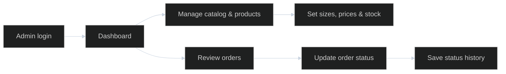

# KitVerse

KitVerse သည် football jersey များကို ရှာဖွေ၊ ရွေးချယ်၊ မှာယူနိုင်သည့် PHP နှင့် MariaDB/MySQL အခြေပြု e-commerce project ဖြစ်သည်။ Customer storefront နှင့် role ကန့်သတ်ထားသော admin dashboard ပါဝင်ပြီး XAMPP ဖြင့် local တွင် run နိုင်သည်။

## အဓိကလုပ်ဆောင်ချက်များ

| Customer | Admin |
| --- | --- |
| Product ရှာဖွေခြင်း၊ league/club/kit type ဖြင့် filter လုပ်ခြင်း | Sales၊ orders၊ customers၊ inventory overview ကြည့်ခြင်း |
| Product size၊ stock၊ discount ကြည့်ခြင်း | Category၊ league၊ club၊ product စီမံခြင်း |
| Session wishlist၊ guest cart၊ jersey name/number ထည့်ခြင်း | Size၊ SKU၊ stock နှင့် price override ပြင်ခြင်း |
| Account ဖွင့်ခြင်း၊ checkout၊ order history ကြည့်ခြင်း | Order status ပြောင်းခြင်း၊ product image တင်ခြင်း |

Checkout တွင် cash on delivery, KBZPay, WavePay နှင့် AYA Pay ကို ရွေးနိုင်သည်။ Digital payment များသည် manual confirmation အတွက်ဖြစ်ပြီး payment gateway အလိုအလျောက်ချိတ်ဆက်ထားခြင်း မရှိပါ။ စျေးနှုန်းများကို MMK ဖြင့်ပြထားသည်။ Product discount သည် 0–90% ဖြစ်နိုင်ပြီး jersey personalization ထည့်လျှင် တစ်ထည်လျှင် 5,000 MMK ထပ်ပေါင်းသည်။

## အသုံးပြုထားသော နည်းပညာ

- PHP 8+ (PDO MySQL, sessions)
- MariaDB/MySQL
- HTML, CSS, JavaScript
- XAMPP (Apache + MySQL) အတွက် local setup

Composer သို့မဟုတ် npm install အဆင့် မလိုပါ။

## Local setup

1. Repository ကို `C:\xampp\htdocs\kitverse` တွင်ထားပါ။
2. XAMPP Control Panel မှ Apache နှင့် MySQL ကို start လုပ်ပါ။
3. **Database အသစ်တည်ဆောက်မည့်အခါမှသာ** phpMyAdmin တွင် `database/schema.sql` ကို import လုပ်ပါ။ ဤ file သည် `kitverse_db` ကို ဖန်တီးပြီး table များကို drop/recreate လုပ်သောကြောင့် ရှိပြီးသား data အပေါ် ထပ်မတင်ပါနှင့်။
4. phpMyAdmin တွင် `kitverse_db` ကိုရွေးပြီး `database/sample_catalog.sql` ကို **တစ်ကြိမ်သာ** import လုပ်ပါ။ Sample catalog တွင် categories, leagues, clubs, products နှင့် sizes ပါဝင်သည်။
5. Browser တွင် [http://localhost/kitverse/](http://localhost/kitverse/) ကိုဖွင့်ပါ။ Apache port ကိုပြောင်းထားလျှင် URL တွင် port ထည့်ပါ (ဥပမာ `http://localhost:8080/kitverse/`)။

Database account သည် ပုံမှန်အားဖြင့် user `root`၊ password အလွတ်ကိုသုံးသည်။ ကိုယ့်စက်၏ MySQL credentials မတူလျှင် Apache/PHP environment တွင် `KITVERSE_DB_USER` နှင့် `KITVERSE_DB_PASS` ကိုသတ်မှတ်ပါ။ Connection setting ကို `index.php` နှင့် `bootstrap.php` တွင်ဖတ်နိုင်သည်။

### ရှိပြီးသား database ကို update လုပ်ရန်

Discount feature မပါသေးသော ယခင် KitVerse database အတွက် `database/migrations/2026-09-30-product-discounts.sql` ကို တစ်ကြိမ် import လုပ်ပါ။ Data ရှိပြီးသား database တွင် `schema.sql` ကို ထပ် import မလုပ်ပါနှင့်။

### Admin account ဖန်တီးရန်

Project folder ထဲတွင် terminal ဖွင့်ပြီး အောက်ပါ command ကို run ပါ။ Email နှင့် အနည်းဆုံး စာလုံး 8 လုံးပါသော password ကို prompt တွင်ဖြည့်ပါ။ ရှိပြီးသား email ကိုထည့်လျှင် ထို account ၏ password နှင့် admin role ကို update လုပ်မည်။

```powershell
C:\xampp\php\php.exe scripts\set_admin_password.php
```

ထို့နောက် `?page=login` မှ sign in လုပ်ပါ။ Admin dashboard သို့ login ပြီးနောက် ဝင်နိုင်သည်။

## Customer order flow



Diagram label များကို မြန်မာစာ font rendering ပြဿနာမဖြစ်စေရန် English ဖြင့်ရေးထားသည်။ Product ရွေးချိန်တွင် name/number personalization ထည့်နိုင်သည်။ Guest အနေဖြင့် cart ထဲထည့်နိုင်သော်လည်း checkout လုပ်ရန် account လိုသည်။ Order တင်ချိန်တွင် stock ကို ထပ်စစ်ပြီး database transaction အတွင်း order၊ order items၊ payment record သိမ်း၊ stock လျော့၊ cart ရှင်းသည်။ Order နှင့် payment status တို့သည် အစတွင် `pending` ဖြစ်သည်။

## Admin flow



Admin သည် `pending → confirmed → processing → packed → shipped → delivered` သို့မဟုတ် `cancelled` status များကို ရွေးပြောင်းနိုင်သည်။ Dashboard တွင် orders၊ sales value၊ customers နှင့် low stock အချက်အလက်များကို ပြထားသည်။

## Project structure

```text
kitverse/
├── index.php                  # Routes, form actions, authentication, cart/admin logic
├── bootstrap.php              # CLI script အတွက် database connection
├── parts/                     # Storefront, checkout, orders, admin page components
│   ├── checkout-action.php    # Order transaction နှင့် stock update
│   └── product-image-upload.php
├── assets/                    # CSS, JavaScript, concept images, uploaded product images
│   └── images/{productId}/    # Admin မှ တင်ထားသော product photos
├── database/
│   ├── schema.sql             # Fresh install schema
│   ├── sample_catalog.sql     # Demo catalog
│   └── migrations/            # Existing database updates
└── scripts/
    └── set_admin_password.php # CLI admin account setup/reset
```

`index.php?page=...` ပုံစံဖြင့် page များကို route လုပ်ထားသည်။ အဓိက page များမှာ `home`, `shop`, `clubs`, `product`, `wishlist`, `cart`, `login`, `register`, `checkout`, `orders` နှင့် `admin` ဖြစ်သည်။ Database schema တွင် table 11 ခုရှိပြီး catalog (`categories`, `leagues`, `clubs`, `products`, `product_variants`), accounts/cart (`users`, `cart_items`) နှင့် orders (`orders`, `order_items`, `payments`, `order_status_history`) ကို သိမ်းထားသည်။

## Product images နှင့် data သတိပြုရန်

- Admin → Products မှ JPG, PNG, WebP (အများဆုံး 8 MB) image တင်နိုင်သည်။ Image အသစ်မရွေးဘဲ product ပြင်လျှင် လက်ရှိ image ကို ဆက်သုံးမည်။
- Upload များကို `assets/images/{productId}/` တွင်သိမ်းသည်။ Deploy သို့မဟုတ် backup လုပ်လျှင် ထို folder ကိုပါထည့်ပါ။
- `assets/` ထဲရှိ hero နှင့် sample jersey concept images များသည် demo visuals ဖြစ်ပြီး တရားဝင် club merchandise ပုံများ မဟုတ်ပါ။
- Sample catalog တွင် user၊ order၊ cart item၊ payment record မပါပါ။ Customer data နှင့် credentials အစစ်များကို repository ထဲ မထည့်ပါနှင့်။

## ပြဿနာဖြေရှင်းရန်

| လက္ခဏာ | စစ်ရန် |
| --- | --- |
| `Database unavailable` | XAMPP MySQL run နေသလား၊ `kitverse_db` import ပြီးပြီလား၊ DB credentials မှန်သလား |
| Site မဖွင့်နိုင် | Apache run နေသလား၊ project သည် `htdocs/kitverse` ထဲတွင်ရှိသလား၊ Apache port မှန်သလား |
| Product မပေါ် | `sample_catalog.sql` ကို fresh database ထဲ import ပြီးပြီလား |
| Admin ဝင်မရ | CLI script ဖြင့် admin email/password ပြန်သတ်မှတ်ပြီး active account ဖြင့် login လုပ်ပါ |
